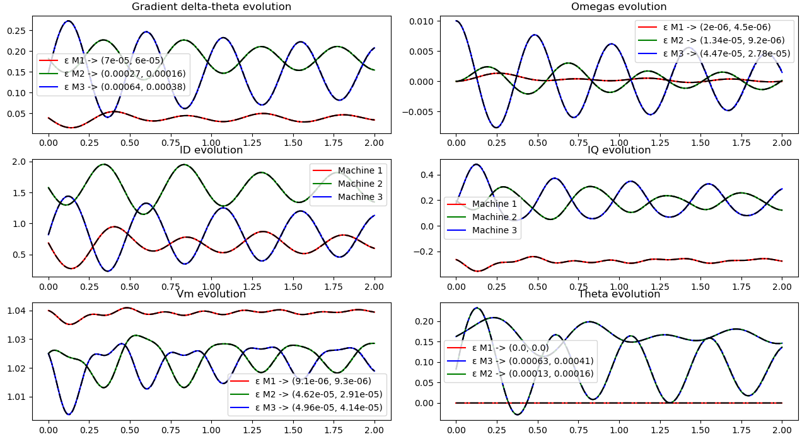

# Integrating PINNs to time-domain simulations

This library provides a Differential-Algebraic system of Equations (DAEs) solvers implemented in PyTorch based on the Simultaneous-Implicit method. The developed algorithms, based on Runge-Kutta integration schemes, allow the integration of Physics-Informed Neural Networks, boosting their computation performance and unlocking a wide range of modelling and privacy opportunities.

The motivation, methodology and applications are discussed in the following paper:

Ignasi Ventura and Jochen Stiasny and Spyros Chatzivasileiadis. ["Integrating Physics-Informed Neural Networks into Power System Dynamic Simulations"](https://arxiv.org/pdf/2404.13325.pdf). 2024.

## Installation

To install latest on GitHub:

```
pip install git+https://github.com/ignvenad/Integrating-PINNs-to-TDS
```

## Examples
We encourage those who are interested in using this library to run the [main.py](https://github.com/ignvenad/Integrating-PINNs-to-TDS/blob/main/main.py) with the default parameters and the ones reproduced in the paper and stated below.

The simulation parameters invoked with [main.py](https://github.com/ignvenad/Integrating-PINNs-to-TDS/blob/main/main.py):

- `--system` is the studied system in the simulation. For now, only the IEEE 9-bus test system is supported.
- `--machine` denotes the generator that can be modelled with a PINN.
- `--event_type` specifies which type of contingency is to be considered.
- `--event_location` fixes the location of the contingency.
- `--event_magnitude` specifies the contingency's magnitude.
- `--sim_time` is the simulation time.
- `--time_step_size` is the time step used in the Simulataneous-Implicit algorithm.
- `--rk_scheme` represents the integration scheme for the differential equations.
- `--compare_pure_RKscheme` flag only if we want to compare the hybrid and pure Runge-Kutta solvers.
- `--compare_ground_truth` flag only if we want to see the ground truth simulated with commercial software. 
- `--plot_selection` to state which type of developed figure is preferred.
- `--gpu` requires access to the gpu for inference.

#### Supported Runge-Kutta schemes:
- `trapezoidal` Trapezoidal rule.
- `backward_euler` Backward Euler or Implicit Euler method.

#### Supported network contingencies:
- `w_setpoint` Relative rotor-angle speed &Delta; &omega; steps.
- `p_setpoint` Mechanical power output &#80; steps.

## Basic Usage
This library provides one main interface `main` which contains all the information required to run the desired DAE simulations.

The `main` file leverages three main scripts:
- [initial_conditions_calculation.py](https://github.com/ignvenad/Integrating-PINNs-to-TDS/blob/main/src/initial_conditions_calculation.py) to compute the initial conditions of the DAE simulation.
- [PINN_architecture.py](https://github.com/ignvenad/Integrating-PINNs-to-TDS/blob/main/src/pinn_architecture.py) to define the fully-connected neural network.
- [tds_dae_rk_schemes.py](https://github.com/ignvenad/Integrating-PINNs-to-TDS/blob/main/src/tds_dae_rk_schemes.py) which contains the Simultaneous-Implicit algorithm and the PINN integration.

`post_processing` folder contains the plotting capabilities of this repository, `gt_simulations` the used ground truth simulations obtained with conventional software, `final_models` a trained PINN for each dynamical component of the test system, and `config_files` the used network and dynamical component parameters.

To boost the Simultaneous-Implicit algorithm with PINNs, the `tds_dae_rk_schemes.TDS_simulation` needs to activate the `pinn_boost` flag specifying the component modelled with a PINN, as long as the weights and operational limits of such PINN, `pinn_weights` and `pinn_ops_limits` respectively. These inputs are to be changed in the `main` file with either the released PINNs or imported PINNs.

## Reproducibility

The results published in the pre-print can be attained with the following parameters.

#### Table 1 with `--time_step_size` = 1e-2 and `--plot_selection` = 1
`Simulation 1` &rArr; Default parameters

`Simulation 2` &rArr; Default parameters + set argument `--event_location` = 3

`Simulation 3` &rArr; Default parameters + set arguments `--event_location` = 2, `--event_type` = 'p_setpoint' and `--event_magnitude` = 0.8

#### Figure 1 with `--time_step_size` = 1e-2 and `--plot_selection` = 2

`Simulation 2` &rArr; Default parameters + set argument `--event_location` = 3

#### Table 2 with `--time_step_size` = 4e-2 and `--plot_selection` = 1
`Simulation 1` &rArr; Default parameters

`Simulation 2` &rArr; Default parameters + set argument `--event_location` = 3

`Simulation 3` &rArr; Default parameters + set arguments `--event_location` = 2, `--event_type` = 'p_setpoint' and `--event_magnitude` = 0.8

#### Figure 2 with `--time_step_size` = 5e-3 and `--plot_selection` = 3
`Simulation 2` &rArr; Default parameters + set argument `--event_location` = 3

The following figure shows the results of `Simulation 2` with the flags `--compare_pure_RKscheme` and `--compare_ground_truth` active. The results shown in the legend illustrate the L1 norm between the ground truth and the pure and hybrid RK simulations. The first value represents the pure RK simulation and the second the hybrid RK simulation boosted by the provided PINN for machine 3. These values are used in the paper for `Simulation 2` in Table 1.

<p align="center">

</p>

## References

The motivation, methodology and applications are discussed in the following paper. If you find this work helpful, please cite this work:

```
@misc{
    ventura2024TDSPINNs,
    title={Integrating Physics-Informed Neural Networks into Power System Dynamic Simulations}, 
    author={Ignasi Ventura and Jochen Stiasny and Spyros Chatzivasileiadis},
    year={2024},
    eprint={2404.13325},
    archivePrefix={arXiv}
}
``` 

## License

This project is available under the MIT License.
